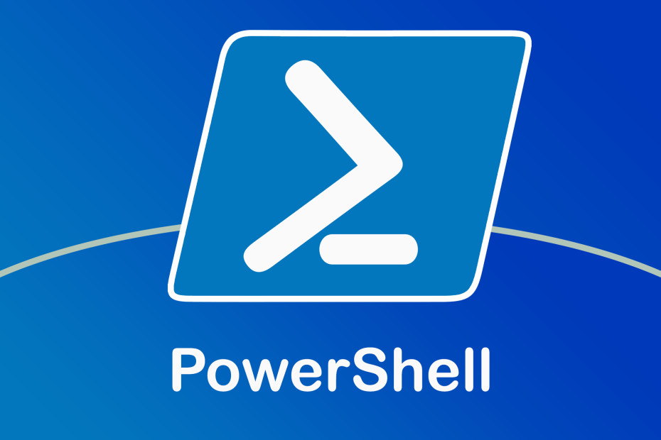
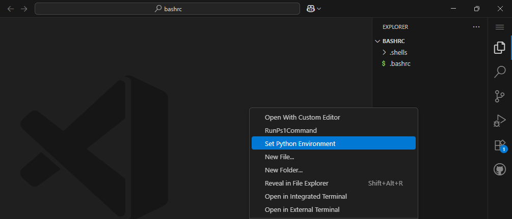
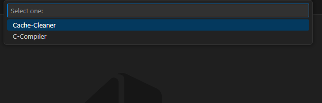
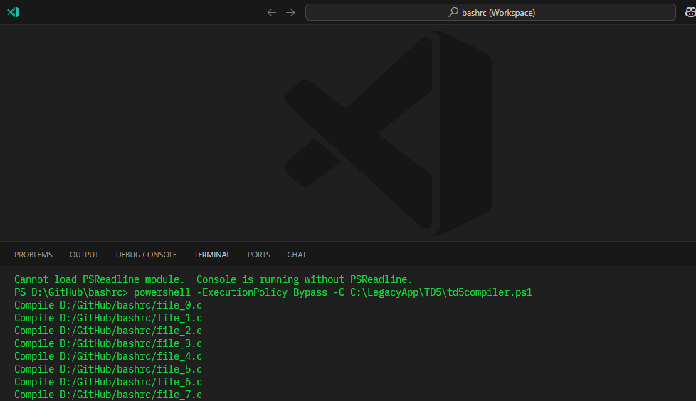

# ⚡ Run PowerShell Command VS Code Extension

  
[](https://marketplace.visualstudio.com/items?itemName=JuanJoseSolorzano.execps1command)
[](https://opensource.org/licenses/MIT)

## 🌟 Overview

**Run PowerShell Command** supercharges your VS Code workflow with lightning-fast PowerShell script execution! Configure your favorite scripts and run them with a single click directly from the Explorer context menu.

---

## 🚀 Key Features

| Feature | Icon | Description |
|---------|------|-------------|
| **Quick Execution** | ⚡ | Run PowerShell scripts instantly from VS Code |
| **Custom Script Library** | 📚 | Save and organize multiple scripts with custom labels |
| **Flexible Run Options** | 🖥️ | Choose terminal visibility or background execution |
| **Explorer Integration** | 📁 | Access scripts via right-click context menu |
| **Smart Notifications** | 💬 | Get execution status alerts with success/failure indicators |

---

## 🛠️ Getting Started

### 📥 Installation
1. Download the latest `.vsix` from [Releases](https://github.com/JuanJoseSolorzano/ExecPS1Command/releases)
2. In VS Code:  
   `Ctrl+Shift+P` → `Extensions: Install from VSIX...` → Select downloaded file

### 🛒 Install from Extension Marketplace

1. 🔍 Open the Extensions view (`Ctrl+Shift+X`)
2. 📝 Search for **JuanJose** and select **Run PowerShell Command**
3. ⬇️ Click **Install**

### 🚀 How to use it

1. `Right-Click` on the file explorer:


2. `From command palet:`


3. `See the PS1 script output in the VSCODE terminal`


### ⚙️ Configuration
Add your scripts to VS Code settings (`settings.json`):

```json
{
  "RunPs1Command.scripts": [
    {
      "label": "Update Modules",
      "command": "C:\\Scripts\\update.ps1",
      "terminal": true
    },
    {
      "label": "Clean Temp Files",
      "command": "D:\\Utils\\cleanup.ps1",
      "terminal": false
    }
  ]
}
```
> **Tip:**  
> `terminal = true` will display the script's output in the VS Code integrated terminal; otherwise, a PowerShell terminal will pop up.